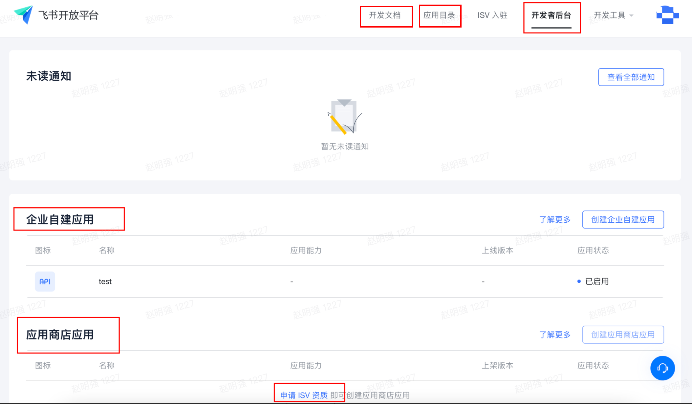

[**README of Larksuite(Overseas)**](README.md) | 飞书

# 飞书开放接口SDK

## 概述

---

- 飞书开放平台，便于企业应用与飞书集成，让协同与管理更加高效，[概述](https://open.feishu.cn/document/uQjL04CN/ucDOz4yN4MjL3gzM)

- 飞书开发接口SDK，便捷调用服务端API与订阅服务端事件，例如：消息&群组、通讯录、日历、视频会议、云文档、 OKR等具体可以访问 [飞书开放平台文档](https://open.feishu.cn/document/) 看看【服务端
  API】。

## 安装方法

```shell script
  npm i @larksuiteoapi/allcore
```

## 术语解释
- 飞书（FeiShu）：Lark在中国的称呼，主要为国内的企业提供服务，拥有独立的[域名地址](https://www.feishu.cn)。
- LarkSuite：Lark在海外的称呼，主要为海外的企业提供服务，拥有独立的[域名地址](https://www.larksuite.com/) 。
- 开发文档：开放平台的开放接口的参考，**开发者必看，可以使用搜索功能，高效的查询文档**。[更多介绍说明](https://open.feishu.cn/document/) 。
- 开发者后台：开发者开发应用的管理后台，[更多介绍说明](https://open.feishu.cn/app/) 。
- 企业自建应用：应用仅仅可在本企业内安装使用，[更多介绍说明](https://open.feishu.cn/document/uQjL04CN/ukzM04SOzQjL5MDN) 。
- 应用商店应用：应用会在 [应用目录](https://app.feishu.cn/?lang=zh-CN) 展示，各个企业可以选择安装，[更多介绍说明](https://open.feishu.cn/document/uQjL04CN/ugTO5UjL4kTO14CO5kTN) 。




## 快速使用

---

### 调用服务端API

- **必看** [如何调用服务端API](https://open.feishu.cn/document/ukTMukTMukTM/uYTM5UjL2ETO14iNxkTN/guide-to-use-server-api)
  ，了解调用服务端API的过程及注意事项。
  
- 更多使用示例，请看[packages/sample/src/api](packages/sample/src/api)  

#### 使用`企业自建应用`访问 修改用户部分信息API 示例

```javascript
const lark = require("@larksuiteoapi/allcore");

// 企业自建应用的配置
// AppID、AppSecret: "开发者后台" -> "凭证与基础信息" -> 应用凭证（App ID、App Secret）
// VerificationToken、EncryptKey："开发者后台" -> "事件订阅" -> 事件订阅（Verification Token、Encrypt Key）。
const appSettings = lark.core.newInternalAppSettings("AppID", "AppSecret", "VerificationToken", "EncryptKey")

// 当前访问的是飞书，使用默认存储、默认日志（Debug级别），更多可选配置，请看：README.zh.md->高级使用->如何构建整体配置（Config）。
const conf = lark.core.newConfig(lark.core.Domain.FeiShu, appSettings, new lark.core.ConsoleLogger(), lark.core.LoggerLevel.INFO, new lark.core.DefaultStore())

// 发送消息的内容
const body = {
    "open_id": "user open id",
    "msg_type": "text",
    "content": {
        "text": "test send message",
    },
}
// 构建请求
const req = lark.api.newRequest("message/v4/send", "POST", lark.api.AccessTokenType.Tenant, body)
// 发送请求
lark.api.sendRequest(conf, req).then(r => {
    // 打印请求的RequestID
    console.log(r.getRequestID())
    // 打印请求的响应状态吗
    console.log(r.getHTTPStatusCode())
    console.log(r) // r = response.body
}).catch(e => {
    // 请求的error处理
    console.log(e)
})
```

#### [使用`应用商店应用`调用 服务端API 示例](doc/ISV.APP.README.zh.md)

### 订阅服务端事件

- [订阅事件概述](https://open.feishu.cn/document/ukTMukTMukTM/uUTNz4SN1MjL1UzM) ，了解订阅事件的过程及注意事项。
- 更多使用示例，请看[packages/sample/src/event](packages/sample/src/event)（含：结合express的使用）

#### 使用`企业自建应用` 订阅 [首次启用应用事件](https://open.feishu.cn/document/ukTMukTMukTM/uQTNxYjL0UTM24CN1EjN) 示例

```javascript
const lark = require("@larksuiteoapi/allcore");

// 企业自建应用的配置
// AppID、AppSecret: "开发者后台" -> "凭证与基础信息" -> 应用凭证（App ID、App Secret）
// VerificationToken、EncryptKey："开发者后台" -> "事件订阅" -> 事件订阅（Verification Token、Encrypt Key）。
const appSettings = lark.core.newInternalAppSettings("AppID", "AppSecret", "VerificationToken", "EncryptKey")

// 当前访问的是飞书，使用默认存储、默认日志（Debug级别），更多可选配置，请看：README.zh.md->高级使用->如何构建整体配置（Config）。
const conf = lark.core.newConfig(lark.core.Domain.FeiShu, appSettings, new lark.core.ConsoleLogger(), lark.core.LoggerLevel.INFO, new lark.core.DefaultStore())

// 设置 首次启用应用 事件的处理者
lark.event.setTypeHandler(conf, "app_open", (ctx, event) => {
    // 打印请求的Request ID
    console.log(ctx.getRequestID());
    // 打印事件
    console.log(event);
})

// 启动httpServer，"开发者后台" -> "事件订阅" 请求网址 URL：https://domain
// startup event http server, port: 8089
lark.event.startServer(conf, 8089)

```

### 处理消息卡片回调

- [消息卡片开发流程](https://open.feishu.cn/document/ukTMukTMukTM/uAzMxEjLwMTMx4CMzETM) ，了解订阅事件的过程及注意事项
- 更多使用示例，请看[packages/sample/src/card](packages/sample/src/card)（含：结合express的使用）

#### 使用`企业自建应用`处理消息卡片回调示例

```javascript
const lark = require("@larksuiteoapi/allcore");

// 企业自建应用的配置
// AppID、AppSecret: "开发者后台" -> "凭证与基础信息" -> 应用凭证（App ID、App Secret）
// VerificationToken、EncryptKey："开发者后台" -> "事件订阅" -> 事件订阅（Verification Token、Encrypt Key）。
const appSettings = lark.core.newInternalAppSettings("AppID", "AppSecret", "VerificationToken", "EncryptKey")

// 当前访问的是飞书，使用默认存储、默认日志（Debug级别），更多可选配置，请看：README.zh.md->高级使用->如何构建整体配置（Config）。
const conf = lark.core.newConfig(lark.core.Domain.FeiShu, appSettings, new lark.core.ConsoleLogger(), lark.core.LoggerLevel.INFO, new lark.core.DefaultStore())

// 设置 消息卡片 的处理者
// 返回值：可以为""、新的消息卡片的Json字符串 
lark.card.setHandler(conf, (ctx, card) => {
    // 打印消息卡片
    console.log(card)
    console.log(card.action)
    return "{\"config\":{\"wide_screen_mode\":true},\"i18n_elements\":{\"zh_cn\":[{\"tag\":\"div\",\"text\":{\"tag\":\"lark_md\",\"content\":\"[飞书](https://www.feishu.cn)整合即时沟通、日历、音视频会议、云文档、云盘、工作台等功能于一体，成就组织和个人，更高效、更愉悦。\"}}]}}";
})

// 设置 "开发者后台" -> "应用功能" -> "机器人" 消息卡片请求网址：https://domain
// startup event http server, port: 8089
lark.event.startServer(conf, 8089)
```

## 高级使用

---

### 如何构建应用配置（AppSettings）

```javascript
const lark = require("@larksuiteoapi/allcore");

// 防止应用信息泄漏，配置环境变量中，变量（4个）说明：
// APP_ID："开发者后台" -> "凭证与基础信息" -> 应用凭证 App ID
// APP_SECRET："开发者后台" -> "凭证与基础信息" -> 应用凭证 App Secret
// VERIFICATION_TOKEN："开发者后台" -> "事件订阅" -> 事件订阅 Verification Token
// ENCRYPT_KEY："开发者后台" -> "事件订阅" -> 事件订阅 Encrypt Key
// 企业自建应用的配置，通过环境变量获取应用配置
const appSettings = lark.core.getInternalAppSettingsByEnv()
// 应用商店应用的配置，通过环境变量获取应用配置
const appSettings = lark.core.getISVAppSettingsByEnv()


// 参数说明：
// AppID、AppSecret: "开发者后台" -> "凭证与基础信息" -> 应用凭证（App ID、App Secret）
// VerificationToken、EncryptKey："开发者后台" -> "事件订阅" -> 事件订阅（Verification Token、Encrypt Key）
// 企业自建应用的配置
const appSettings = lark.core.newInternalAppSettings(appID, appSecret, verificationToken, encryptKey string)
// 应用商店应用的配置
const appSettings = lark.core.newISVAppSettings(appID, appSecret, verificationToken, encryptKey string)

```

### 如何构建整体配置（Config）

- 访问 飞书、LarkSuite 或者 其他URL域名
- 应用的配置
- 日志接口（Logger）的实现，用于输出SDK处理过程中产生的日志，便于排查问题。
    - 可以使用业务系统的日志实现，请看示例代码：[packages/core/src/log/log.ts](packages/core/src/log/log.ts) ConsoleLogger
- 存储接口（Store）的实现，用于保存访问凭证（app/tenant_access_token）、临时凭证(app_ticket）
    - 推荐使用Redis实现，请看示例代码：[sample/config/redis_store.go](packages/sample/src/config/config.ts) RedisStore
        - 减少获取 访问凭证 的次数，防止调用访问凭证 接口被限频。
        - 应用商品应用，接受开放平台下发的app_ticket，会保存到存储中，所以存储接口（Store）的实现的实现需要支持分布式存储。

```javascript

const lark = require("@larksuiteoapi/allcore");

// 推荐使用Redis实现存储接口（Store），减少访问获取AccessToken接口的次数
// 参数说明：
// domain：URL域名地址，值范围：lark.core.Domain.FeiShu / lark.core.Domain.LarkSuite / 其他URL域名地址
// appSettings：应用配置
// logger：[日志接口](core/log/log.go)
// loggerLevel：输出的日志级别 log.LevelInfo/LevelInfo/LevelWarn/LevelError
// store: [存储接口](core/store/store.go)，用来存储 app_ticket/access_token
const conf = lark.core.newConfig(domain: lark.core.Domain, appSettings: lark.core.AppSettings, logger: lark.core.Logger, loggerLevel: lark.core.LoggerLevel, store: lark.core.Store)

```    

### 如何构建请求（Request）

- 更多使用示例，请看：[packages/sample/src/api](packages/sample/src/api)（含：文件的上传与下载）

```javascript

const lark = require("@larksuiteoapi/allcore");

// 创建请求
// httpPath：API路径（`open-apis/`之后的路径），例如：https://domain/open-apis/contact/v3/users/:user_id，则 httpPath："contact/v3/users/:user_id"
// httpMethod: GET/POST/PUT/BATCH/DELETE
// accessTokenType：API使用哪种token访问，取值范围：lark.api.AccessTokenType.App/Tenant/User，例如：lark.api.AccessTokenType.Tenant
// input：请求体（可能是lark.api.FormData()（例如：文件上传））,如果不需要请求体（例如一些GET请求），则传：undefined
// optFns：扩展函数，一些不常用的参数封装，如下：
  // lark.api.setPathParams({"user_id":4})：设置URL Path参数（有:前缀）值，当httpPath="contact/v3/users/:user_id"时，请求的URL="https://{domain}/open-apis/contact/v3/users/4"
  // lark.api.setQueryParams({"age":4,"types":[1,2]})：设置 URL qeury，会在url追加?age=4&types=1&types=2   
  // lark.api.setTimeoutOfMs(1000)，设置http请求，超时时间毫秒值
  // lark.api.setIsResponseStream()，设置响应的是否是流，例如下载文件，这时：output值是Buffer类型
  // lark.api.setIsNotDataField(),设置响应的是否 没有`data`字段，业务接口都是有`data`字段，所以不需要设置
  // lark.api.setTenantKey("TenantKey")，以`应用商店应用`身份，表示使用`tenant_access_token`访问API，需要设置
  // lark.api.setUserAccessToken("UserAccessToken")，表示使用`user_access_token`访问API，需要设置
const req = lark.api.newRequest(httpPath: string, httpMethod: string, accessTokenType: AccessTokenType, input: any, ...optFns: OptFn[] )

```

### 如何发送请求

- 更多使用示例，请看：[packages/sample/src/api](packages/sample/src/api)（含：文件的上传与下载）

```javascript
const lark = require("@larksuiteoapi/allcore");

// 参数说明：
// conf：整体的配置（Config）
// req：请求（Request）
// 返回值说明：
// resp: http response body json
// err：发送请求，出现的错误
async lark.api.sendRequest(conf: lark.core.config.Config, req: lark.api.request.Request)

```

### lark.core.Context的常用方法

```javascript
const lark = require("@larksuiteoapi/allcore");

// 在事件订阅与消息卡片回调的处理者中，可以从lark.core.Context中获取 Config
const conf = lark.core.getConfigByCtx(ctx: lark.core.Context)

```


###  下载文件工具

- 通过网络请求下载文件
- 更多使用示例，请看：[packages/sample/src/tools/downFile.js](packages/sample/src/tools/downFile.js)

```javascript
const lark = require("@larksuiteoapi/allcore");

// 参数说明：
// url：文件的HTTP地址
// timeoutOfMs：请求超时的时间（毫秒）
// 返回值说明：
// resp: http response body binary
// err：发送请求，出现的错误
async lark.api.downloadFile(url: string, timeoutOfMs: number)

```

## License

---

- MIT

## 联系我们

---

- 飞书：[服务端SDK](https://open.feishu.cn/document/ukTMukTMukTM/uETO1YjLxkTN24SM5UjN) 页面右上角【这篇文档是否对你有帮助？】提交反馈
    
